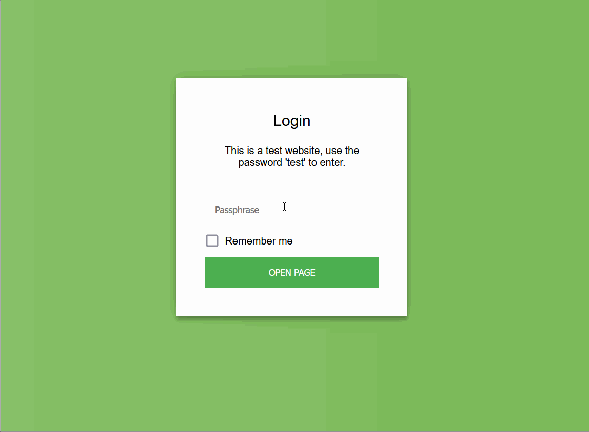

# Template for Encrypted Single Page Website

This template repository makes it easy to create a password protected page that is hosted on Github pages.
This can be useful for information or events that should not be available to everyone, e.g. for your birthday, wedding or a corporate event.

To check the [demo](https://a-nau.github.io/password-protected-website-template) use the password `test`.



**Disclaimer**: Please be aware, that I (or the dependencies) might have missed something, so do not assume this to be bullet proof. Do not share bank information or similar this way.

## Usage

- [Create a repository from a template](https://docs.github.com/en/repositories/creating-and-managing-repositories/creating-a-repository-from-a-template) by clicking the `use this template` button
- Select a repository name (your URL will be `{GITHUB-ACCOUNT-NAME}.github.io/{REPOSITORY-NAME}`)
- Choose the repository to be **private**, if you don't want people to be able to access the contents without the password
- [Create a Github secret](https://docs.github.com/en/actions/security-guides/encrypted-secrets#creating-encrypted-secrets-for-a-repository) named `DECRYPTION_PASSPHRASE` and set the `value` to your desired password (note that the CI pipeline will fail on the first attempt due to the missing password)
- [Set the publishing source](https://docs.github.com/en/pages/getting-started-with-github-pages/configuring-a-publishing-source-for-your-github-pages-site#choosing-a-publishing-source) to the `main` branch in order to activate hosting with Github Pages

To customize the website:

- You can customize the login page
  - adjust the [encrypt.yml](.github/workflows/encrypt.yml), i.e. line `18` to set the title, instructions and button name
    - `run: staticrypt main.html ${{ secrets.TEMP_PASSWORD }} -f password_template.html -o index.html --title "Login Title" --instructions "You Login Instructions" --decrypt-button "Your Login Button" --embed true`
  - For details and to change the full layout, see [StatiCrypt](https://github.com/robinmoisson/staticrypt)
- Edit the `main.html` which will be shown to visitors after encryption (the encrypted version, that is hosted is `index.html`)
  - Assets can be used as usual and will not be encrypted

### Encrypted Assets

If you want your assets to be encrypted as well uncomment the commented lines in the [`encrypt.yml`](.github/workflows/encrypt.yml) and remove the duplicate line during `Encrypt index`.
Note, this only replaces all directly linked images, CSS and JavaScript file in the HTML document with an in-place base64 representation.
Thus, your relative links in files will probably not work anymore, since their location changed.

### Local Usage

If you don't want to have any of your data (even) in a private repository you can also convert it locally and only upload the `index.html` afterwards.
To do this, follow these steps:

- Build the image
  ```
  docker build -t ppw .
  ```
- Run the encryption
  ```
  docker run -it --rm --name ppw -e PASSWORD=test --mount type=bind,source=${PWD},target=/code ppw
  ```
- Ignore changes to `main.html`
  ```
  git update-index --skip-worktree main.html
  ```
  Optionally the same is needed for your assets.

## Credits

- The encryption is made by [StatiCrypt](https://github.com/robinmoisson/staticrypt): [MIT](https://github.com/robinmoisson/staticrypt/blob/main/LICENSE) License
- We use the [workflow](https://github.com/Jack-alope/staticrypt-github-actions/blob/main/.github/workflows/encrypt.yml) from [staticrypt-github-actions](https://github.com/Jack-alope/staticrypt-github-actions) as a basis: [MIT](https://github.com/Jack-alope/staticrypt-github-actions/blob/main/LICENSE) License
- We use [Bootstrap](https://getbootstrap.com/), including one of their [examples](https://getbootstrap.com/docs/4.0/examples/) ([demo](https://getbootstrap.com/docs/4.0/examples/cover/#)): [MIT](https://github.com/twbs/bootstrap/blob/main/LICENSE) License
- We use code from [six-four](https://github.com/chrissimpkins/six-four/tree/master) to determine image MIME types: [MIT](https://github.com/chrissimpkins/six-four/blob/master/LICENSE) License
